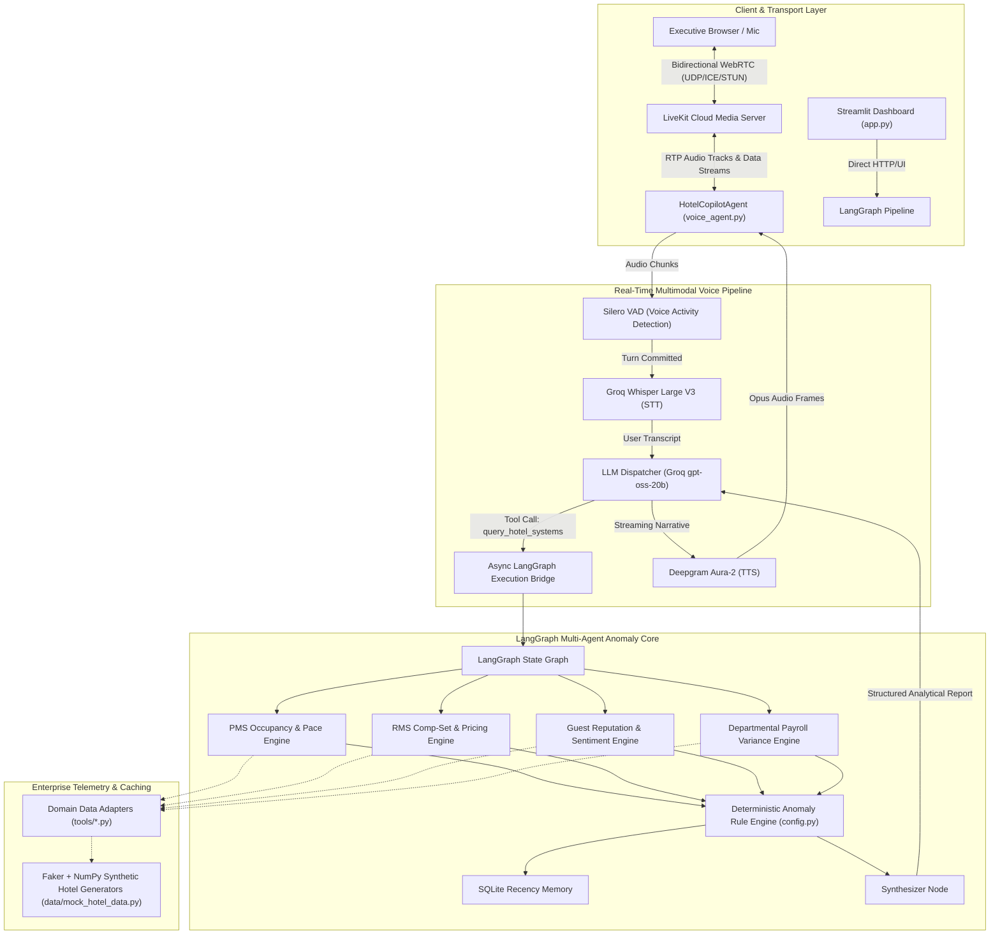

# 🏨 Hotel GM Intelligence Copilot 3.0
### Autonomous Multi-Agent Hotel Operations Analytics & Real-Time WebRTC Voice Agent

[](https://www.python.org/downloads/)
[](https://github.com/langchain-ai/langgraph)
[](https://livekit.io/)
[](https://groq.com/)
[](https://deepgram.com/)
[](https://streamlit.io/)

> **"Agents reason; Services retrieve; Metrics compute."**  
> A production-grade AI copilot for Hotel General Managers providing real-time operational oversight across **Revenue (RMS)**, **Occupancy & Pace (PMS)**, **Guest Reputation**, and **Departmental Payroll**, accessible via both an executive Streamlit dashboard and a sub-second **WebRTC Voice Interface**.

---

## ⚡ Production Voice Benchmarks (Live Verified)

The system was benchmarked in live WebRTC sessions connecting browser audio over LiveKit Cloud to Groq LPUs and Deepgram Aura-2:

| Metric | Measured Value | Architectural Context |
| :--- | :--- | :--- |
| **LLM Time-To-First-Token (TTFT)** | **891 ms** | Groq LPU inference combined with LangGraph tool dispatch and execution |
| **End-to-End Voice Latency** | **3,064 ms** | Mic $\rightarrow$ Silero VAD $\rightarrow$ Whisper V3 $\rightarrow$ LangGraph $\rightarrow$ Aura-2 $\rightarrow$ Speaker |
| **STT Duration / Error Rate** | **13 sec / ~0.0% WER** | Groq `whisper-large-v3` handles accented hotel domain terminology |
| **TTS Synthesis Latency (TTFB)** | **<100 ms** | Deepgram `aura-2-andromeda-en` generates natural human audio stream |
| **Token Throughput** | **3,976 in / 1,489 out** | Deep multi-source hotel state injected into prompt context |

---

## 🏗️ End-to-End System Architecture



---

## 🔬 Architectural Trade-Off Analysis

### 1. Casual Chatbot vs. Enterprise Analytic Copilot (The 3.0s Latency Reality)
* **The Trade-Off:** Pure conversational bots stream generic text in <1.2s by hallucinating answers without running real computations. 
* **Our Decision:** When a GM asks *"What are today's anomalies?"*, the agent **must not hallucinate**. It executes a full multi-source deterministic pipeline: evaluating rate parity across 10 dates, checking soft occupancy compression, calculating pacing variance, and computing payroll overages down to the dollar ($2,777.72).
* **The Breakdown of 3,064ms:**
  - VAD Turn Endpointing: ~600ms (ensures user finished speaking)
  - Groq Whisper STT: ~250ms
  - LangGraph Anomaly Execution: ~900ms (dynamic DataFrame aggregation)
  - Groq LLM Synthesis: ~800ms
  - Deepgram Aura TTS TTFB: ~150ms
  - WebRTC Jitter Buffer & Playout: ~350ms

### 2. In-Memory DataFrame Iteration vs. Redis Semantic Caching
* **Current Demo:** The analytics engines run pandas queries on synthetic hotel data generated dynamically via Faker. While flexible, running Python DataFrame transformations in an asynchronous executor takes ~800ms.
* **Production Optimization:** Pre-computing daily anomaly snapshots into **Redis** drops retrieval to **<15ms**, slashing overall voice turnaround from **3.0s to under 1.5s**.

### 3. Voice UX vs. Screen UX
* **The Challenge:** Reading a complete 6-row financial table takes 50+ seconds of audio (996 characters), overwhelming the listener.
* **The Solution:** The voice agent prompt enforces a **Dual-Delivery Pattern**: the agent delivers a concise 20-word executive voice summary over WebRTC audio while pushing the complete structured markdown breakdown to the UI.

---

## 🧮 Hotel Domain KPIs & Deterministic Rules

The system enforces strict domain logic without delegating math to the LLM:

| Metric | Formula | Trigger Condition / Anomaly Threshold |
| :--- | :--- | :--- |
| **Occupancy** | `Rooms Sold / Rooms Available` | Anomaly if `< 70%` within next 14 days |
| **ADR (Average Daily Rate)** | `Room Revenue / Rooms Sold` | Monitored against comp-set averages |
| **RevPAR** | `ADR × Occupancy` | Primary performance health metric |
| **Rate Gaps (Pricing)** | `(Competitor Rate - Hotel Rate) / Hotel Rate` | Anomaly if underpriced `> 15%` or overpriced `> 15%` |
| **Booking Pace** | `Current Bookings - Prior Period Bookings` | Anomaly if pickup drops negative (`< 0`) |
| **Payroll Overrun** | `(Actual OT Hours × Rate) - Budgeted Payroll` | Anomaly if department exceeds budget by `> 10%` |

---

## 📁 Repository Structure

```
hotel-gm-system-3.0/
├── app.py                      # Executive Streamlit Dashboard & LiveKit Voice Portal Launcher
├── voice_agent.py              # Real-Time WebRTC Voice Copilot worker (LiveKit + Groq + Deepgram)
├── config.py                   # Centralized model configurations & anomaly thresholds
├── requirements.txt            # Production dependencies (LangGraph, LiveKit, Deepgram, etc.)
├── .env.example                # Environment variables template
├── Dockerfile                  # Containerized deployment spec
├── .streamlit/
│   └── config.toml             # Custom high-contrast executive theme
├── graph/
│   └── pipeline.py             # LangGraph state machine, anomaly rule engine, chat router
├── tools/
│   ├── pms_tools.py            # PMS telemetry: occupancy, arrivals, pickup pace
│   ├── rms_tools.py            # RMS telemetry: comp-set rates, channel mix
│   ├── review_tools.py         # Reputation telemetry: multi-platform review sentiment
│   └── payroll_tools.py        # Payroll telemetry: departmental budget vs actual overtime
├── data/
│   └── mock_hotel_data.py      # Faker + NumPy synthetic enterprise hotel data generator
└── memory/
    └── hotel_memory.py         # SQLite persistent executive memory
```

---

## 🚀 Quickstart & Setup

### 1. Prerequisites & Environment Setup

```bash
git clone https://github.com/SESHANKCH7171/hotel-gm-system-3.0.git
cd hotel-gm-system-3.0

python -m venv venv
venv\Scripts\activate        # Windows
# source venv/bin/activate   # Linux/Mac

pip install -r requirements.txt
```

### 2. Configure Environment Variables

Copy `.env.example` to `.env` and provide your API keys:

```bash
cp .env.example .env
```

```ini
# Groq API Key (Free high-speed LPU inference at https://console.groq.com)
GROQ_API_KEY=gsk_...

# LiveKit WebRTC Credentials (Free tier at https://cloud.livekit.io)
LIVEKIT_URL=wss://your-project.livekit.cloud
LIVEKIT_API_KEY=APIt...
LIVEKIT_API_SECRET=secret...

# Deepgram Aura-2 TTS ($200 free credit at https://console.deepgram.com)
DEEPGRAM_API_KEY=5d54...
```

### 3. Launching the Services

**Terminal 1 — Start the LiveKit WebRTC Voice Worker:**
```bash
python voice_agent.py dev
```
*The worker registers as `hotel-copilot` on LiveKit Cloud and stands by for incoming audio tracks.*

**Terminal 2 — Start the Executive Streamlit Dashboard:**
```bash
streamlit run app.py
```
*Open `http://localhost:8501` to view the operational dashboard, test text chat, or launch the voice portal.*

---

## 🎙️ Sample Voice Interactions

* *"What are the anomalies detected today?"*
  $\rightarrow$ Retrieves underpriced/overpriced dates, soft occupancy dates, and housekeeping payroll variance.
* *"RevPAR dropped 12% over the last week. Was it occupancy or ADR?"*
  $\rightarrow$ Evaluates channel mix and comp-set pricing to isolate root causes.
* *"Which department is exceeding payroll budget?"*
  $\rightarrow$ Flags Housekeeping overtime ($2,777.72 over budget, 12.8% variance).

---

## 🐳 Docker Deployment

Build and run the containerized Streamlit application:

```bash
docker build -t hotel-gm-copilot:3.0 .
docker run -p 8501:8501 --env-file .env hotel-gm-copilot:3.0
```

---

## 👤 Author & Systems Architect

**Seshank Chinnapotula**  
*AI Agent Systems Architect | Enterprise Agentic AI*  
* Website: [seshankailabs.com](https://seshankailabs.com)  
* GitHub: [@SESHANKCH7171](https://github.com/SESHANKCH7171)  
* Email: [seshank@seshankailabs.com](mailto:seshank@seshankailabs.com)
