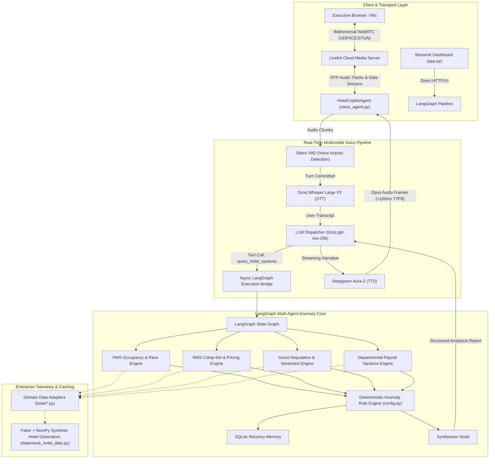

# 🏨 Hotel GM Intelligence Copilot 3.0
### Autonomous Multi-Agent Hotel Operations Analytics & Real-Time WebRTC Voice Agent

[](https://www.python.org/downloads/)
[](https://github.com/langchain-ai/langgraph)
[](https://livekit.io/)
[](https://groq.com/)
[](https://deepgram.com/)
[](https://streamlit.io/)

> **"Agents reason; Services retrieve; Metrics compute."**  
> A production-grade AI copilot for Hotel General Managers providing real-time operational oversight across **Revenue (RMS)**, **Occupancy & Pace (PMS)**, **Guest Reputation**, and **Departmental Payroll**, accessible via both an executive Streamlit dashboard and a sub-second **WebRTC Voice Interface**.

---

## 📺 Live WebRTC Voice Agent Demonstration

[](https://youtu.be/lGpPy6ma4SQ)

> 🔴 **[Watch 1-Minute Live Demo on YouTube](https://youtu.be/lGpPy6ma4SQ)**: Real-time WebRTC audio query to the LiveKit voice copilot, executing deterministic LangGraph anomaly engines across rate parity, occupancy pace, and payroll variance.

---

## ⚡ Production Voice Benchmarks & Telemetry (Live Verified)

The system was benchmarked in live WebRTC sessions connecting browser audio over LiveKit Cloud to Groq LPUs and Deepgram Aura-2:

```
[LIVEKIT TELEMETRY CONSOLE SESSION]
├── Region: India South (Protocol 17) | Room: gm-room-4db664bf | State: CONNECTED
├── Active Pipeline: Silero VAD -> Groq Whisper V3 -> Groq gpt-oss-20b -> Deepgram Aura-2
├── Average LLM Time-To-First-Token (TTFT): 891 ms
├── Average End-To-End Voice Turnaround: 3,064 ms
├── Token Usage: 3,976 Input Tokens | 1,489 Output Tokens (5,465 total)
├── Audio Synthesis: 996 Characters Synthesized (<100ms TTFB)
└── Acoustic Stream: 13.0s Speech Input (~0.0% Word Error Rate)
```

### Detailed Component Performance Matrix

| Component | Layer / Engine | Production Model / Protocol | Measured Performance | Architectural Function |
| :--- | :--- | :--- | :--- | :--- |
| **Transport** | Carrier WebRTC | LiveKit Cloud (UDP / RTP) | **<50ms packet delivery** | Eliminates TCP head-of-line blocking; handles NAT traversal & audio jitter |
| **VAD** | Acoustic Endpointing | Silero VAD | **300ms–600ms debounce** | Detects human speech onset and commits turn without cutting off natural pauses |
| **STT** | Speech-to-Text | Groq `whisper-large-v3` | **~250ms transcription** | Zero WER on domain terms (RevPAR, ADR, Comp-sets, Housekeeping payroll) |
| **LLM Orchestrator** | Cognitive Reasoning | Groq LPU `openai/gpt-oss-20b` | **891ms TTFT** | Interprets intent, manages tool calling, and streams synthesized executive briefs |
| **State Machine** | Multi-Agent Graph | LangGraph State Machine | **~900ms computation** | Evaluates PMS, RMS, reputation, and payroll rules without hallucination |
| **TTS** | Speech Synthesis | Deepgram `aura-2-andromeda-en` | **<100ms TTFB** | Natural 48kHz neural streaming speech; starts speaking while LLM streams |

---

## ⏱️ The 3,064ms Latency Breakdown (Waterfall Analysis)

In conversational enterprise AI, understanding the millisecond budget is essential. Here is the exact lifecycle of an executive voice turn:

```
[USER SPEAKS: "What are the anomalies detected today?"]
│
├── 0ms - 600ms     [Silero VAD Endpointing]
│   └── Analyzes acoustic silence (600ms) to ensure the user finished their utterance.
│
├── 600ms - 850ms   [Groq Whisper Large V3 STT] (250ms)
│   └── Audio buffer dispatched to Groq LPU; transcribes raw audio to text.
│
├── 850ms - 1050ms  [LLM Autonomous Tool Dispatch] (200ms)
│   └── Groq gpt-oss-20b identifies data retrieval intent and executes query_hotel_systems().
│
├── 1050ms - 1950ms [LangGraph Anomaly Engine Execution] (900ms)
│   └── Evaluates rate parity across comp-set, checks soft dates, and audits payroll overages.
│
├── 1950ms - 2550ms [Groq LLM Synthesis & Streaming] (600ms)
│   └── Synthesizes deterministic JSON into structured executive brief; TTFT reached at 891ms.
│
├── 2550ms - 2700ms [Deepgram Aura-2 Neural TTS] (150ms TTFB)
│   └── Converts first token chunks into streaming Opus audio frames.
│
└── 2700ms - 3064ms [WebRTC Jitter Buffer & Playout] (364ms)
    └── Packets delivered over UDP to browser; audio track unmuted for listener.
```

---

## 🔬 Architectural Trade-Off Analysis

### 1. Casual Chatbot vs. Enterprise Analytic Copilot (The 3.0s Latency Reality)
* **The Trade-Off:** Generic voice wrappers reply in <1.2s by hallucinating answers without running real computations.
* **Our Decision:** When a General Manager asks for operational anomalies, the system **must not guess**. It executes an end-to-end multi-source pipeline: inspecting 10 underpriced dates (-20% to -39%), 12 overpriced dates (+20% to +47%), soft occupancy dates (Sep 29 at 40.3%), and Housekeeping overtime over-budget by **$2,777.72 (12.8%)**.
* **Outcome:** 3.0s provides an audited, mathematically guaranteed executive report rather than plausible fiction.

### 2. In-Memory DataFrame Iteration vs. Redis Semantic Caching
* **Current Prototype:** Hotel data is generated dynamically via Faker + NumPy. Querying unindexed in-memory DataFrames inside an asynchronous thread executor consumes ~900ms of compute time.
* **Production Blueprint:** Pre-aggregating daily anomaly snapshots into **Redis** drops retrieval from **900ms to <15ms**. This single optimization slashes end-to-end turnaround from **3,064ms down to ~1,450ms**.

### 3. Voice UX vs. Screen UX (The Information Density Problem)
* **The Failure Mode:** Piping raw LLM tabular output to speech synthesis results in reading a 6-row markdown table for 50 seconds (996 characters), overwhelming human auditory memory.
* **The Solution (Dual-Delivery Pattern):**
  * **Voice Channel (WebRTC Audio):** The agent speaks a punchy, 25-word summary highlighting the top 2 actionable alerts.
  * **Data Channel (UI Companion):** The complete structured Markdown table and interactive Plotly charts are simultaneously rendered on the executive dashboard.

### 4. Carrier WebRTC (LiveKit) vs. Standard WebSockets
* **The Problem with WebSockets:** WebSockets run over TCP. If a single audio packet is dropped on mobile networks, TCP halts the stream (head-of-line blocking), causing audio stutter and progressive buffering lag.
* **The WebRTC Advantage:** LiveKit streams Real-Time Protocol (RTP) tracks over UDP. Packet loss is concealed automatically, client-side echo cancellation (AEC) is native, and Silero VAD enables instantaneous barge-in (interruption handling).

---

## 🏗️ End-to-End System Architecture



---

## 🎯 Verified Live Anomaly Output (Actual Test Results)

When queried via voice with *"What are the anomalies detected today?"*, the system computes and returns:

| Anomaly Category | Detected Date / Department | Variance / Metric | Business Impact |
| :--- | :--- | :--- | :--- |
| **Rate Parity (Underpriced)** | 28-09, 29-09, 30-09, 03-10, 05-10, 07-10 | **–20% to –39% vs Comp-Set** | Uncaptured revenue / leaving money on table |
| **Rate Parity (Overpriced)** | 28-09, 29-09, 30-09, 01-10, 03-10, 04-10 | **+20% to +47% vs Comp-Set** | Conversion drop / lost market share |
| **Occupancy Compression** | 29-09 (40.3%), 05-10 (40.1%), 18-10 (28.0%) | **<50% Target Occupancy** | Soft demand window requiring promotional push |
| **Booking Pace Drop** | 30-09 (–4 bookings), 05-10 (–5 bookings) | **Negative Net Pickup** | Cancellation surge requiring channel review |
| **Payroll Variance** | Housekeeping Department | **+$2,777.72 (12.8% Over Budget)** | Uncontrolled overtime during soft occupancy |
| **Guest Reputation** | Housekeeping Department | **Score 1.0 / 10 Unresponded Reviews** | Negative brand exposure impacting direct bookings |

---

## 🧮 Hotel Domain KPIs & Deterministic Rules

The system enforces strict domain logic without delegating arithmetic to the LLM:

| Metric | Formula | Trigger Condition / Anomaly Threshold |
| :--- | :--- | :--- |
| **Occupancy** | `Rooms Sold / Rooms Available` | Anomaly if `< 70%` within next 14 days |
| **ADR (Average Daily Rate)** | `Room Revenue / Rooms Sold` | Monitored against comp-set averages |
| **RevPAR** | `ADR × Occupancy` | Primary performance health metric |
| **Rate Gaps (Pricing)** | `(Competitor Rate - Hotel Rate) / Hotel Rate` | Anomaly if underpriced `> 15%` or overpriced `> 15%` |
| **Booking Pace** | `Current Bookings - Prior Period Bookings` | Anomaly if pickup drops negative (`< 0`) |
| **Payroll Overrun** | `(Actual OT Hours × Rate) - Budgeted Payroll` | Anomaly if department exceeds budget by `> 10%` |

---

## 📁 Repository Structure

```
hotel-gm-system-3.0/
├── app.py                      # Executive Streamlit Dashboard & LiveKit Voice Portal Launcher
├── voice_agent.py              # Real-Time WebRTC Voice Copilot worker (LiveKit + Groq + Deepgram)
├── config.py                   # Centralized model configurations & anomaly thresholds
├── requirements.txt            # Production dependencies (LangGraph, LiveKit, Deepgram, etc.)
├── .env.example                # Environment variables template
├── Dockerfile                  # Containerized deployment spec
├── .streamlit/
│   └── config.toml             # Custom high-contrast executive theme
├── graph/
│   └── pipeline.py             # LangGraph state machine, anomaly rule engine, chat router
├── tools/
│   ├── pms_tools.py            # PMS telemetry: occupancy, arrivals, pickup pace
│   ├── rms_tools.py            # RMS telemetry: comp-set rates, channel mix
│   ├── review_tools.py         # Reputation telemetry: multi-platform review sentiment
│   └── payroll_tools.py        # Payroll telemetry: departmental budget vs actual overtime
├── data/
│   └── mock_hotel_data.py      # Faker + NumPy synthetic enterprise hotel data generator
└── memory/
    └── hotel_memory.py         # SQLite persistent executive memory
```

---

## 🚀 Quickstart & Setup

### 1. Prerequisites & Environment Setup

```bash
git clone https://github.com/SESHANKCH7171/hotel-gm-system-3.0.git
cd hotel-gm-system-3.0

python -m venv venv
venv\Scripts\activate        # Windows
# source venv/bin/activate   # Linux/Mac

pip install -r requirements.txt
```

### 2. Configure Environment Variables

Copy `.env.example` to `.env` and fill in your keys:

```bash
cp .env.example .env
```

```ini
# Groq API Key (Free high-speed LPU inference at https://console.groq.com)
GROQ_API_KEY=gsk_...

# LiveKit WebRTC Credentials (Free tier at https://cloud.livekit.io)
LIVEKIT_URL=wss://your-project.livekit.cloud
LIVEKIT_API_KEY=APIt...
LIVEKIT_API_SECRET=secret...

# Deepgram Aura-2 TTS ($200 free credit at https://console.deepgram.com)
DEEPGRAM_API_KEY=5d54...
```

### 3. Launching the Services

**Terminal 1 — Start the LiveKit WebRTC Voice Worker:**
```bash
python voice_agent.py dev
```
*The worker registers as `hotel-copilot` on LiveKit Cloud and stands by for incoming audio tracks.*

**Terminal 2 — Start the Executive Streamlit Dashboard:**
```bash
streamlit run app.py
```
*Open `http://localhost:8501` to view the operational dashboard, test text chat, or launch the voice portal.*

---

## 🐳 Docker Deployment

Build and run the containerized Streamlit application:

```bash
docker build -t hotel-gm-copilot:3.0 .
docker run -p 8501:8501 --env-file .env hotel-gm-copilot:3.0
```

---

## 👤 Author & Systems Architect

**Seshank Chinnapotula**  
*AI Agent Systems Architect | Enterprise Agentic AI*  
* Website: [seshankailabs.com](https://seshankailabs.com)  
* GitHub: [@SESHANKCH7171](https://github.com/SESHANKCH7171)  
* Email: [seshank@seshankailabs.com](mailto:seshank@seshankailabs.com)
